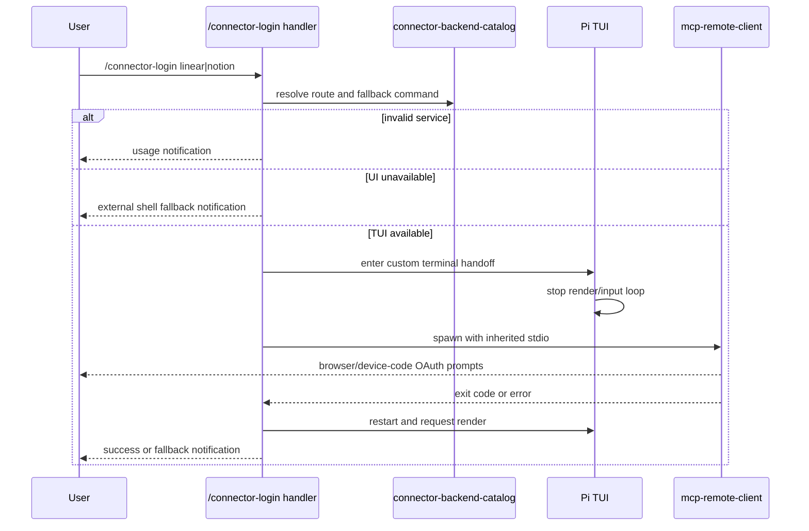

<!-- markdownlint-disable MD013 MD025 MD036 MD060 -->

# Connector Login TUI Recovery - Plan

## Goal Capsule

- **Objective:** `/connector-login linear|notion` OAuth 흐름이 Pi TUI의 키보드 입력과 화면 렌더링을 망가뜨리지 않도록 터미널 소유권을 안전하게 넘기고 되돌린다.
- **Authority hierarchy:** 사용자 선택은 “코드 수정 + 안전한 fallback 문서화”이며, 기존 connector catalog가 Linear/Notion endpoint와 실행 인자 진실 공급원이다.
- **Execution profile:** Standard bug fix; 자동화 가능한 lifecycle 검증과 실제 Pi TUI 수동 검증을 함께 요구한다.
- **Stop conditions:** MCP tool 호출 경로, OAuth consent 자체, local-only OAuth state 저장 위치, Quotio/GitHub connector 동작은 바꾸지 않는다.
- **Tail ownership:** 구현은 코드 복구, fallback 안내, 타입/테스트 검증, 실제 `/connector-login` 수동 확인까지 완료해야 끝난다.

---

## Product Contract

### Summary

현재 `/connector-login`은 Pi TUI가 터미널을 잡고 있는 중에 OAuth CLI를 같은 stdin/stdout/stderr에 직접 붙인다.
이 계획은 OAuth CLI가 필요한 동안 Pi TUI를 일시 중지하고, child process 종료 뒤 TUI를 복구하며, 실패하거나 비-TUI 환경이면 사용자가 일반 쉘에서 같은 login command를 실행할 수 있게 안내한다.

### Problem Frame

`extensions/workspace-connectors/index.ts`의 interactive login runner는 `spawn`을 `stdio: "inherit"`로 호출한다.
이 호출은 OAuth CLI에게 실제 TTY를 주지만, Pi TUI가 raw-mode 입력과 화면 렌더링을 계속 관리하는 동안 실행되어 키 입력 먹통, escape sequence 깨짐, 종료 후 terminal mode 꼬임을 유발할 수 있다.

### Actors

- A1. Pi 사용자: `/connector-login linear|notion`으로 workspace connector OAuth를 시작한다.
- A2. Pi TUI: editor, keybindings, render loop, terminal raw mode를 관리한다.
- A3. OAuth CLI: `mcp-remote-client`가 browser/device-code prompt와 terminal I/O를 처리한다.
- A4. Workspace connector runtime: 로그인 뒤 `workspace_mcp_list_tools`와 `workspace_mcp_call_tool`로 MCP endpoint에 연결한다.

### Requirements

**Terminal lifecycle**

- R1. `/connector-login linear|notion`은 OAuth CLI 실행 동안 Pi TUI가 terminal input/rendering 소유권을 놓고, 종료 후 다시 시작해야 한다.
- R2. child process가 성공, 실패, spawn error, signal 종료 중 어떤 방식으로 끝나도 TUI 복구와 사용자 알림이 실행되어야 한다.
- R3. 비-TUI 또는 UI 없는 실행 컨텍스트에서는 inherited stdio interactive login을 시도하지 않고, 외부 쉘 fallback을 안내해야 한다.
- R4. invalid service 입력의 usage 안내와 기존 `/connector-login linear|notion` command contract는 유지해야 한다.

**Connector compatibility**

- R5. Linear/Notion login command, MCP runtime args, auth/status/fallback 문구는 `connector-backend-catalog`에서 파생되어 중복 drift를 줄여야 한다.
- R6. `workspace_mcp_list_tools`, `workspace_mcp_call_tool`, `github_gh_cli` tool 실행 경로와 runtime safety policy는 변경하지 않아야 한다.
- R7. OAuth consent, browser approval, token/cache 저장은 계속 human-only 및 local-only boundary 안에 있어야 한다.

**Fallback and documentation**

- R8. README와 secret blueprint 문서는 Pi 안의 login command와 일반 쉘 fallback command를 모두 설명해야 한다.
- R9. `/oh-my-pi` 또는 setup guidance는 login 중 terminal이 꼬였을 때 복구와 재시도 경로를 찾을 수 있게 해야 한다.
- R10. 구현 검증은 타입 검증, lifecycle 단위 검증, 실제 Pi TUI 수동 검증을 포함해야 한다.

### Key Flows

- F1. Successful TUI login
  - **Trigger:** 사용자가 Pi TUI에서 `/connector-login linear` 또는 `/connector-login notion`을 실행한다.
  - **Steps:** service parse 성공 → route 조회 → TUI stop → OAuth CLI가 inherited stdio로 실행 → child exit 0 → TUI start/render → 성공 알림과 `/connector-tools` 확인 안내.
  - **Covers:** R1, R2, R4, R5, R7.
- F2. Login failure or cancellation
  - **Trigger:** OAuth CLI가 non-zero code, signal, spawn error로 끝난다.
  - **Steps:** TUI 복구 → 실패 알림 → catalog 기반 fallback command와 재시도 안내 표시.
  - **Covers:** R2, R5, R8, R9.
- F3. Non-TUI command context
  - **Trigger:** command handler가 UI 없는 모드에서 실행된다.
  - **Steps:** interactive child process를 시작하지 않음 → fallback command를 안내 → 사용자는 일반 쉘에서 로그인 뒤 Pi를 재시작하거나 `/connector-tools`로 확인한다.
  - **Covers:** R3, R8.

### Acceptance Examples

- AE1. TUI 복구: Pi TUI에서 `/connector-login linear`을 실행하고 OAuth CLI를 정상 종료하면 editor 입력, Enter, Escape, 방향키가 같은 세션에서 다시 동작한다.
- AE2. 실패 복구: `mcp-remote-client`가 non-zero로 끝나도 Pi 화면이 복구되고, 알림에는 해당 서비스의 일반 쉘 fallback command가 포함된다.
- AE3. 범위 보존: 로그인 fix 뒤에도 `workspace_mcp_list_tools`와 `workspace_mcp_call_tool`은 기존처럼 `mcp-remote` stdio transport를 사용한다.

### Scope Boundaries

**In scope**

- `/connector-login` interactive subprocess lifecycle 수정.
- Linear/Notion fallback command를 catalog route에서 파생.
- README, secret blueprint, command palette/setup guidance의 safe fallback 문서화.
- focused TypeScript/lifecycle 검증과 실제 Pi TUI 수동 검증.

**Out of scope**

- OAuth provider consent UX 자동화 또는 우회.
- `.mcp-auth`, `.pi`, `~/.pi/agent/auth.json` 같은 local-only state 복사/커밋.
- `workspace_mcp_call_tool` write confirmation policy, GitHub CLI mutation guard, Quotio provider 동작 변경.

**Deferred to Follow-Up Work**

- Pi 자체에 reusable “interactive external command” API가 생기면 oh-my-pi의 local helper를 그 API로 교체한다.
- 여러 Pi packages에서 같은 문제가 반복되면 공통 extension utility로 추출한다.

---

## Planning Contract

### Key Technical Decisions

- KTD1. TUI suspend/resume wrapper를 사용한다: OAuth CLI가 실제 TTY를 필요로 할 수 있으므로 stdio capture로 바꾸지 않고, Pi TUI를 멈춘 동안에만 inherited stdio를 허용한다.
- KTD2. command handler context type을 확장한다: 현재 local `NotificationContext`는 `notify`만 표현하므로, 구현은 `ExtensionCommandContext` 또는 동등한 최소 interface로 `hasUI`와 `ui.custom` 사용 가능성을 드러내야 한다.
- KTD3. fallback command는 connector catalog에서 파생한다: Linear/Notion endpoint와 `mcp-remote@latest` package spec이 이미 catalog에 있으므로, user-facing error와 docs는 같은 route 정보를 기준으로 작성한다.
- KTD4. human-only OAuth boundary를 유지한다: agent/tool이 OAuth consent를 대신 누르거나 token state를 생성하지 않으며, fallback도 사용자가 일반 쉘에서 직접 실행하는 안내로 제한한다.
- KTD5. 검증은 자동 lifecycle 테스트와 수동 TUI smoke test를 분리한다: terminal raw-mode 충돌은 완전 자동화하기 어렵지만, stop/start ordering과 error 복구는 fake context로 검증할 수 있다.

### High-Level Technical Design

### Assumptions

- `ctx.ui.custom()` can be used from extension command handlers in TUI mode and gives access to `tui.stop()`, `tui.start()`, and `requestRender` behavior used by Pi examples.
- `mcp-remote-client` may need a real TTY, so replacing inherited stdio with captured pipes would risk making OAuth login fail.
- The repo currently has no established automated test harness; adding a narrow helper-level test is acceptable if it avoids new heavyweight dependencies.
- Manual verification can use test accounts or existing authenticated workspaces, but local OAuth state remains uncommitted.

### System-Wide Impact

- **Developer UX:** `/connector-login` becomes safe to run from inside Pi instead of requiring a separate terminal by default.
- **Agent/tool parity:** MCP list/call tools remain agent-accessible after human OAuth completion; OAuth consent itself stays human-only.
- **Safety posture:** Local-only state boundaries and write-confirmation policies do not change.
- **Cross-platform behavior:** Windows keeps shell spawning behavior, while Unix-like terminals rely on TUI stop/start restoring raw mode cleanly.

### Risks & Dependencies

| Risk | Mitigation |
|---|---|
| TUI does not restart after child error | Put restart/render in the runner's settled/finalization path and test spawn-error plus non-zero exits with a fake TUI. |
| OAuth CLI requires interactive stdin | Keep inherited stdio only while TUI is stopped; do not switch to captured pipes for the login flow. |
| `mcp-remote@latest` behavior changes | Keep fallback wording generic and derive commands from catalog route data instead of matching CLI output text. |
| Manual verification leaves terminal in bad state | Document `stty sane`/`reset` recovery and external shell fallback. |
| Tests overfit to Pi internals | Test only wrapper ordering, result handling, and message construction; leave full terminal behavior to manual smoke tests. |

### Sources and Research

- `extensions/workspace-connectors/index.ts` contains the problematic `runInteractive` helper and `/connector-login` command registration.
- `extensions/connector-backend-catalog.ts` is the source for Linear/Notion MCP URLs and `mcp-remote-client` login args.
- `extensions/setup-doctor/index.ts` shows existing settled child-process handling for read-only diagnostics.
- `README.md` and `docs/blueprints/secret-references.md` already document connector setup and local-only OAuth state boundaries.
- `docs/solutions/conventions/pi-extension-toggle-cwd-env-2026-06-12.md` reinforces opt-in extension activation and CWD `.env` behavior.
- `docs/solutions/workflow/local-pi-distribution-parallel-prs.md` reinforces commit-safe connector/profile/safety contracts and local-only secret handling.

---

## Implementation Units

### U1. Interactive terminal handoff runner

- **Goal:** Replace the raw `spawn(..., stdio: "inherit")` helper with a runner that gives the OAuth CLI terminal ownership only while Pi TUI is stopped, then always restores Pi TUI.
- **Requirements:** R1, R2, R3, R10; supports F1, F2, F3.
- **Dependencies:** None.
- **Files:** `extensions/workspace-connectors/index.ts`, `extensions/workspace-connectors/interactive-login.test.ts`.
- **Approach:** Type the command context so the runner can see `hasUI` and `ui.custom`; in TUI mode, enter a custom UI scope, stop the TUI, run the child process with inherited stdio, restart/render the TUI on all completion paths, and return a structured result; in non-UI mode, return a structured unsupported result without spawning.
- **Execution note:** Add characterization coverage for the runner before changing `/connector-login` wiring; use fake TUI/spawn dependencies rather than invoking real OAuth.
- **Patterns to follow:** Pi interactive command examples that stop/start TUI around inherited stdio; `extensions/setup-doctor/index.ts` settled-result pattern for avoiding double resolution.
- **Test scenarios:**
  - Fake TUI happy path: given a child exit code 0, runner calls stop before spawn, calls start/render after exit, and returns success.
  - Fake TUI failure path: given child exit code 1, runner still restarts/renders and returns the code.
  - Spawn error path: given spawn emits an error before exit, runner restarts/renders and returns an error result instead of throwing past the command handler.
  - Non-UI path: given `hasUI=false`, runner does not call spawn and returns an unsupported result that can be rendered as fallback guidance.
- **Verification:** Unit-level lifecycle tests pass, and focused TypeScript checking accepts the new context typing.

### U2. Catalog-derived connector login messaging

- **Goal:** Keep `/connector-login` behavior and fallback text aligned with `connector-backend-catalog` so Linear/Notion commands do not drift.
- **Requirements:** R4, R5, R8; supports F1, F2, F3.
- **Dependencies:** U1.
- **Files:** `extensions/connector-backend-catalog.ts`, `extensions/workspace-connectors/index.ts`, `extensions/workspace-connectors/interactive-login.test.ts`.
- **Approach:** Add a route field or formatter that represents the user-runnable login command from the same package/client/url metadata already used by `loginArgs`; update success, failure, non-UI, and spawn-error notifications to include the route label, status guidance, fallback message, and shell-safe command string.
- **Patterns to follow:** Existing `routeWorkspaceMcpConnector` shape and `formatWorkspaceMcpUsage` command usage helpers.
- **Test scenarios:**
  - Linear fallback formatting: given the Linear route, notification text includes `mcp-remote-client` and the Linear MCP URL.
  - Notion fallback formatting: given the Notion route, notification text includes `mcp-remote-client` and the Notion MCP URL.
  - Invalid service: given an unsupported argument, command still emits the existing usage shape and does not call the runner.
  - Success path: exit code 0 emits status guidance without suggesting the flow failed.
- **Verification:** Connector route helpers remain type-safe, and no MCP tool transport code changes are introduced.

### U3. User-facing fallback and recovery documentation

- **Goal:** Make the safe manual path discoverable when embedded login cannot complete or a user's terminal needs recovery.
- **Requirements:** R8, R9; supports F2, F3.
- **Dependencies:** U2.
- **Files:** `README.md`, `docs/blueprints/secret-references.md`, `extensions/setup-doctor/index.ts`.
- **Approach:** Document that `/connector-login` temporarily hands the terminal to the OAuth CLI, list the regular shell fallback commands for Linear and Notion, and add recovery hints for terminal mode issues; keep local-only state warnings intact and do not add real token/cache paths beyond existing boundaries.
- **Patterns to follow:** Existing README command list and `docs/blueprints/secret-references.md` local-only artifact language; `extensions/setup-doctor/index.ts` command palette's short, actionable setup hints.
- **Test scenarios:**
  - README setup path: a new machine user can identify Pi command flow, external shell fallback, and `/connector-tools` confirmation path without reading source code.
  - Secret boundary path: blueprint still says OAuth state is per-machine/local-only and does not encourage copying `.mcp-auth`, `.pi`, or `auth.json`.
  - Palette path: `/oh-my-pi` command output points users toward connector login and fallback/recovery guidance without exposing secrets.
- **Verification:** Documentation references match catalog-derived commands, local-only warnings remain present, and profile blueprint verification still passes if touched files participate in profile metadata.

### U4. End-to-end verification pass

- **Goal:** Prove the fix at the type, helper-lifecycle, and real terminal interaction levels before declaring the bug fixed.
- **Requirements:** R1, R2, R3, R10; covers AE1, AE2, AE3.
- **Dependencies:** U1, U2, U3.
- **Files:** `package.json`, `extensions/workspace-connectors/index.ts`, `extensions/connector-backend-catalog.ts`, `extensions/setup-doctor/index.ts`, `README.md`, `docs/blueprints/secret-references.md`.
- **Approach:** Run the narrow automated checks available in this repo, then manually test both embedded Pi login and fallback shell login; if a lightweight test script is added, keep it scoped to workspace connector lifecycle tests and avoid broad test infrastructure churn.
- **Patterns to follow:** Existing `npm run profile:verify` script for commit-safe profile metadata; focused TypeScript check used in prior oh-my-pi integration work.
- **Test scenarios:**
  - Type check: workspace connector and connector catalog compile with the updated command context and helper imports.
  - Unit test: fake lifecycle tests from U1 and message formatting tests from U2 pass.
  - Manual Linear smoke: `/connector-login linear` returns Pi to an editable prompt after success, cancellation, or failure.
  - Manual Notion smoke: `/connector-login notion` returns Pi to an editable prompt after success, cancellation, or failure.
  - Regression smoke: after existing auth, `/connector-tools linear|notion` can still list tools or reports a normal auth/transport error rather than a TUI corruption symptom.
- **Verification:** The final diff contains no local OAuth state, no `.env` changes, no unrelated connector/provider refactors, and manual verification notes identify any provider that could not be tested.

---

## Verification Contract

| Gate | Applies to | Done signal |
|---|---|---|
| Focused TypeScript check | U1, U2, U4 | Updated workspace connector, catalog, and setup-doctor TypeScript surfaces compile without type errors. |
| Workspace connector lifecycle tests | U1, U2 | Fake TUI/spawn tests prove stop/start ordering, error restoration, non-UI fallback, and route-derived fallback commands. |
| `npm run profile:verify` | U3, U4 | Profile/blueprint metadata remains valid after documentation changes. |
| Manual Pi TUI smoke | U1, U2, U4 | `/connector-login linear\|notion` no longer leaves editor keys or rendering broken after child process exit. |
| Connector regression smoke | U2, U4 | `/connector-tools linear\|notion` behavior is unchanged except for normal auth/transport results. |
| Secret hygiene check | U3, U4 | `.env`, `.mcp-auth`, `.pi`, `auth.json`, sessions, and token material are absent from the diff. |

---

## Definition of Done

- R1-R10 are satisfied without changing the public names of `/connector-login`, `/connector-tools`, `workspace_mcp_list_tools`, `workspace_mcp_call_tool`, or `github_gh_cli`.
- U1-U4 are complete in dependency order, and each unit's test scenarios have either passed or have a documented provider/environment reason for being untestable.
- Pi TUI is restored after success, failure, cancellation, and spawn-error paths in the interactive login flow.
- README, secret blueprint, and command palette guidance describe the safe fallback path and preserve local-only OAuth state boundaries.
- Verification Contract gates pass, with manual smoke results recorded in the implementation handoff or PR body.
- The final diff removes dead-end experimental code and contains no unrelated refactors, no local secret files, and no copied OAuth state.
