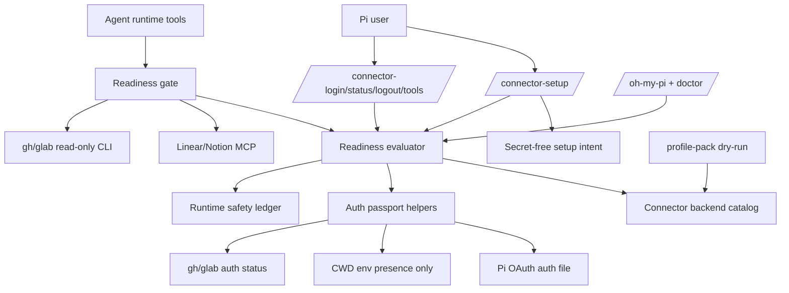
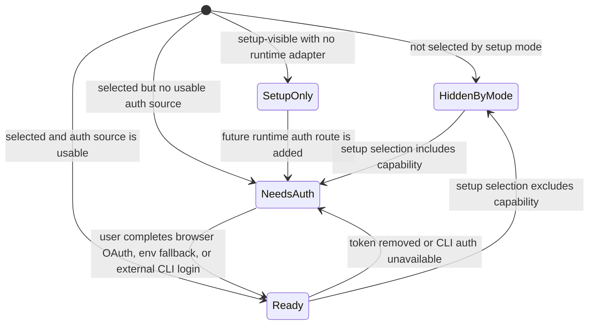
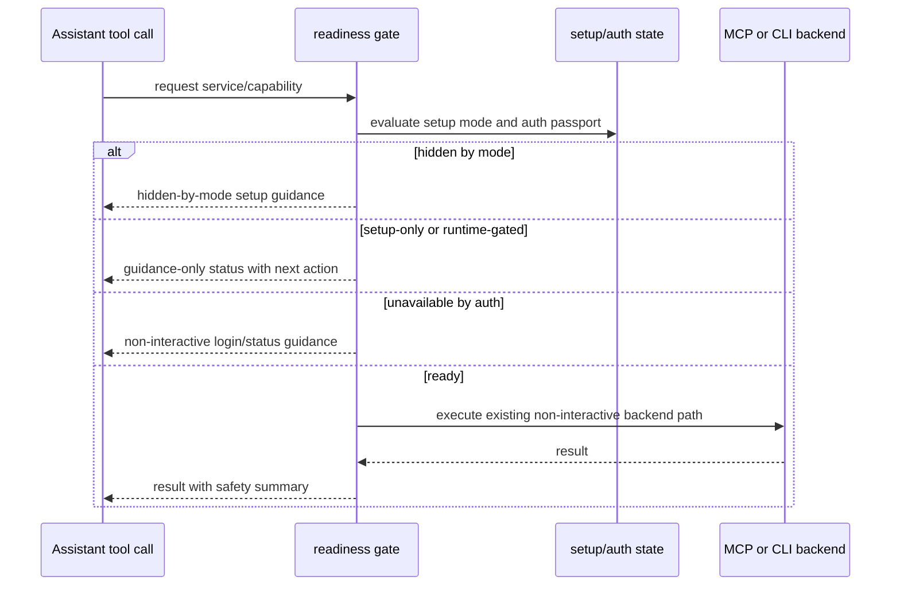

# Connector Setup Skill UX - Plan

## Goal Capsule

- **Objective:** Turn oh-my-pi connector setup into a skill-style control plane that can configure full, selective, or minimal connector exposure across company and personal workspaces without leaking secrets or starting interactive auth from runtime tools.
- **Product authority:** The user explicitly chose to merge all five ce-ideate survivor ideas into one Product Contract before running `/lfg`; this plan implements that full scope without adding runtime Atlassian tool calls.
- **Execution profile:** Code implementation in the `oh-my-pi` repo, with auth, profile, command UX, CLI bridge, safety-ledger, docs, and test coverage changes.
- **Stop conditions:** Stop before implementation if the plan would require secret persistence, runtime browser/terminal login from a tool, write-capable GitLab/GitHub/Jira/Confluence operations, or a fully interactive Atlassian auth flow.
- **Tail ownership:** `/lfg` owns the pipeline after this plan is written; implementation should execute units in dependency order and return structured completion to the caller.

---

## Product Contract

### Summary

Build a connector setup control plane for oh-my-pi that makes `connector-setup` the primary human setup surface while keeping existing login, status, logout, and tool commands as precise sub-actions.
The setup model is driven by capability slots, tenant-aware profiles, auth provenance, and readiness gates so company Jira/Confluence/GitLab and personal Linear/Notion/GitHub can coexist safely.
The first release makes GitLab useful through the already-authenticated `glab` CLI pattern and makes Atlassian setup-visible but runtime-gated until a safe auth route is chosen.

### Problem Frame

Today the connector UX is split across README setup text, profile dry-runs, `/oh-my-pi-doctor`, `/connector-login`, `/connector-status`, `/connector-logout`, `/connector-tools`, and LLM-callable tools.
That split works for the current Linear/Notion plus GitHub shape, but it does not scale to a mixed company/personal environment where Jira, Confluence, GitLab, Linear, Notion, and GitHub have different auth ownership and safety expectations.
The user wants a memorable skill-style setup entrypoint and three explicit setup modes: full setup, selective setup, and minimal setup that excludes issue tracker, wiki, and git tools.

### Key Decisions

- **Connector setup is the control plane.** The primary user journey starts at `connector-setup` or a skill-style equivalent; `/connector-login`, `/connector-status`, `/connector-logout`, and tool listing remain exact sub-actions that the control plane can recommend.
- **Capabilities outrank vendor names.** The model uses capability slots such as issue tracker, wiki, and git, with tenant context such as company or personal deciding whether the backing service is Jira, Confluence, GitLab, Linear, Notion, or GitHub.
- **Auth provenance is a product surface.** Status and logout must show whether readiness comes from Pi-managed OAuth state, CWD env fallback, `gh` CLI, `glab` CLI, or setup-only guidance, without printing secrets.
- **Tool visibility follows readiness.** Runtime tools should be visible, hidden, gated, or guidance-only according to the selected setup mode and auth readiness; runtime tools must never begin interactive login.
- **Company connectors enter in stages.** GitLab starts as a CLI-backed read-only bridge that validates the existing `glab` session; Jira and Confluence enter as Atlassian setup capabilities but remain runtime-gated until a non-interactive auth strategy is selected.

### Actors

- A1. **Pi user** — chooses setup mode, performs browser OAuth or external CLI auth when needed, and controls company/personal scope.
- A2. **Assistant agent** — reads setup state, uses exposed connector tools, and follows runtime safety guidance without initiating login.
- A3. **Connector setup control plane** — maps the user's selected mode to profile intent, auth checks, readiness, and next actions.
- A4. **External workspace services** — Linear, Notion, GitHub, Jira, Confluence, and GitLab surfaces reached through OAuth MCP, CLI sessions, or staged setup guidance.

### Requirements

**Setup UX**

- R1. The product provides one primary setup entrypoint for connector setup that can be invoked as a command or skill-style surface.
- R2. The setup entrypoint supports full setup, selective setup, and minimal setup as explicit user choices.
- R3. Minimal setup excludes issue-tracker, wiki, and git tool affordances by intent rather than treating them as missing or broken.
- R4. Selective setup lets the user choose by tenant, capability, or service without requiring them to memorize backend implementation details.

**Catalog and profiles**

- R5. The connector model represents capability slot, tenant, backend kind, auth strategy, setup-mode membership, tool exposure, and safety policy in one source of truth.
- R6. Company issue tracker, wiki, and git map to Jira, Confluence, and GitLab; personal issue tracker, wiki, and git map to Linear, Notion, and GitHub.
- R7. Profile output remains secret-free and non-destructive: setup may report intended toggles, env var names, auth actions, and local-only paths but must not write secrets by default.
- R8. Adding or changing a connector should update setup, status, logout guidance, and tool exposure from shared metadata rather than duplicating user-facing strings across surfaces.

**Auth and logout safety**

- R9. Status output shows auth provenance for each selected connector without exposing tokens, API keys, auth headers, or unrelated private workspace content.
- R10. Logout supports service, tenant, and capability scopes and previews which local state it will clear before clearing it.
- R11. Logout never silently clears `.env` access keys, `gh` sessions, `glab` sessions, browser accounts, or other auth state not owned by oh-my-pi.
- R12. Runtime connector tools reuse existing credentials or fail with setup guidance; they do not open browsers, prompt for tokens, or run terminal-interactive login.

**Diagnostics and tool exposure**

- R13. Setup status shows current vs desired readiness for the chosen setup mode, including toggles, auth source, local-only state, exposed tools, and next action.
- R14. Tool affordances distinguish safe reads, write-like actions requiring confirmation, unavailable-by-auth, and hidden-by-setup-mode states.
- R15. The assistant-facing prompt guidance stays aligned with the runtime safety policy so read-only and confirm-before-write boundaries remain visible to the model.
- R16. Setup and status outputs distinguish intentional minimal exclusions from misconfiguration.

**Staged company connector entry**

- R17. GitLab support starts by checking the existing `glab` CLI session and exposing a read-only CLI bridge when ready.
- R18. Jira and Confluence are represented in setup and status as Atlassian-backed company capabilities before runtime tool calls are enabled.
- R19. Jira and Confluence runtime tool exposure stays gated until planning selects and validates a non-interactive auth route.
- R20. Existing Linear, Notion, and GitHub behavior remains available for the personal stack unless the selected setup mode hides those capabilities.

### Key Flows

- F1. Full setup
  - **Trigger:** A1 starts connector setup and chooses full setup.
  - **Actors:** A1, A3, A4
  - **Steps:** A3 derives company and personal desired state, checks toggles and local prerequisites, reports GitHub and GitLab CLI readiness, recommends Linear/Notion browser OAuth where missing, marks Atlassian runtime as gated until auth route selection, and emits a secret-free readiness summary.
  - **Covered by:** R1, R2, R5, R6, R9, R13, R17, R18, R19, R20

- F2. Selective setup
  - **Trigger:** A1 chooses selective setup.
  - **Actors:** A1, A3
  - **Steps:** A3 lets A1 choose tenants, capabilities, or services; A3 derives included and excluded connectors; A3 reports desired state and next actions for only the selected surface.
  - **Covered by:** R2, R4, R5, R6, R7, R13

- F3. Minimal setup
  - **Trigger:** A1 chooses minimal setup.
  - **Actors:** A1, A2, A3
  - **Steps:** A3 records issue-tracker, wiki, and git as intentionally excluded; A2 does not see those tools as ready; status reports exclusions as intentional rather than failed auth.
  - **Covered by:** R2, R3, R14, R16

- F4. Runtime tool readiness failure
  - **Trigger:** A2 attempts to use a connector capability that is hidden, gated, or unauthenticated.
  - **Actors:** A2, A3
  - **Steps:** The tool returns a non-interactive setup guidance path that points back to the setup/status surface instead of starting login.
  - **Covered by:** R12, R13, R14, R15

- F5. Scoped logout
  - **Trigger:** A1 requests logout by service, tenant, or capability.
  - **Actors:** A1, A3
  - **Steps:** A3 previews the local state it owns and will clear, lists state it will not touch, performs the clear operation only for owned state, and reports the result.
  - **Covered by:** R9, R10, R11

### Acceptance Examples

- AE1. **Covers R2, R3, R14, R16.** Given minimal setup is selected, when the assistant inspects connector capability, then issue-tracker, wiki, and git tools are absent or marked hidden-by-mode, not unauthenticated.
- AE2. **Covers R2, R6, R13, R17, R18, R19, R20.** Given full setup is selected, when setup status is shown, then it includes personal Linear/Notion/GitHub, company Jira/Confluence/GitLab, GitHub and GitLab CLI readiness checks, and Atlassian runtime-gated status.
- AE3. **Covers R9, R10, R11.** Given personal logout is requested, when the preview is shown, then it identifies Pi-managed personal OAuth state and states that company `glab`, CWD env keys, and browser accounts are untouched.
- AE4. **Covers R12, R15.** Given a runtime tool lacks usable auth, when the agent tries to call it, then the tool returns setup guidance and does not start browser OAuth or terminal login.
- AE5. **Covers R5, R8, R13, R14.** Given a connector entry is added to the shared model, when setup and status run, then user-facing guidance and readiness derive from the shared metadata rather than separate hand-written command text.
- AE6. **Covers R2, R4, R5, R6, R13.** Given selective setup is requested by tenant and capability, when readiness is shown, then only matching connector capabilities are desired and all non-matching connectors are hidden-by-mode rather than failed auth.

### Success Criteria

- Full, selective, and minimal setup can be described from the setup surface without requiring the user to read README setup instructions.
- The setup surface never prints or writes secrets by default.
- Existing personal Linear/Notion/GitHub behavior remains compatible with current users.
- GitLab can be validated through `glab` without inventing a new OAuth flow.
- Jira and Confluence can be represented safely before their runtime auth path is fully implemented.
- The assistant receives fewer misleading connector affordances in minimal or unauthenticated states.

### Scope Boundaries

**In scope**

- `/connector-setup` as the first skill-style command surface, registered as an always-available setup-doctor bootstrap command with richer readiness when workspace connectors are enabled.
- Full, selective, and minimal setup modes backed by secret-free local setup intent.
- Company/personal capability modeling for issue tracker, wiki, and git.
- Auth provenance, scoped logout preview, readiness diagnostics, and setup-guided runtime failures.
- GitLab read-only CLI bridge modeled after the existing GitHub CLI bridge.
- Jira and Confluence setup-visible/runtime-gated representation.

**Deferred for later**

- Actual Pi skill file, slash-command alias package, or input-transform alias beyond the command surface if those prove useful after the command UX lands.
- Registration-time dynamic tool removal or per-session active-tool mutation; this release uses status/prompt affordances plus runtime gates to mark hidden-by-mode and unavailable-by-auth states.
- Fully interactive Atlassian OAuth or API-token onboarding beyond setup guidance.
- Write-capable Jira, Confluence, GitLab, or GitHub operations.
- Cross-service semantic broker APIs beyond readiness/tool metadata.
- Automatic package installation or `.env` mutation from setup.

**Outside this product identity**

- A general enterprise connector marketplace.
- Copying, syncing, or committing OAuth state or local secrets.
- Replacing service-native CLIs such as `gh` or `glab`.
- Folding Quotio/provider setup into connector setup modes; provider diagnostics remain in `/oh-my-pi-doctor` and profile-pack flows.

### Dependencies / Assumptions

- `gh` and `glab` are available and already authenticated on the user's machine when their CLI-backed connectors are enabled.
- Atlassian runtime auth strategy is not yet settled; the first release can expose setup intent and gated readiness without runtime Jira/Confluence tool calls.
- Pi's current extension command/tool surface is sufficient for a command-first skill-style UX; a dedicated skill wrapper can be added later without changing the readiness model.
- Existing connector safety policy and profile-pack patterns remain the source of truth for no-secrets behavior.

### Outstanding Questions

**Resolved during planning**

- The first skill-style surface is `/connector-setup`, because the repo already exposes setup-like slash commands and no existing oh-my-pi skill wrapper is present.
- Readiness-gated affordances use shared readiness state plus runtime refusal/guidance first, because the existing tool registration model is static at extension load.
- The shared catalog grows to carry tenant, capability slot, setup-mode membership, exposure state, auth ownership, and safety policy IDs; provider setup stays outside connector mode algebra.

**Deferred, non-blocking**

- Which non-interactive Atlassian auth route should eventually unlock Jira and Confluence runtime tools.
- Whether a later Pi skill or input-transform alias should wrap `/connector-setup` once the command UX proves stable.
- Whether Pi gains dynamic active-tool APIs that can hide minimal-mode tools at registration or session-start time instead of only at status/prompt/runtime-gate level.

### Sources / Research

- `README.md` — current install/setup, connector command, profile, and local-only guidance.
- `CONCEPTS.md` — Workspace Connector, Connector Backend Catalog, Browser OAuth, Access-key Fallback, Auth Passport, Readiness-Gated Tool Affordance, and Runtime Safety Policy Ledger vocabulary.
- `extensions/connector-backend-catalog.ts` — current backend, adapter, auth strategy, and route model.
- `extensions/workspace-connectors/index.ts` — current connector command and tool registration surface.
- `extensions/workspace-connectors/auth.ts` — local OAuth state, auth status, access-key fallback, and logout behavior.
- `extensions/runtime-safety-policy-ledger.ts` — read-only, confirm-write, redaction, and CLI mutation guard policy.
- `extensions/setup-doctor/index.ts` — current doctor and command palette behavior.
- `scripts/profile-pack.mjs` and `docs/profiles/*.profile.json` — current default, workspace, proxy-provider, full profile, lock, and dry-run setup intent.
- `extensions/workspace-connectors/interactive-login.test.ts` — current connector catalog/auth/command tests.
- Local `glab auth status --help` output — `glab` supports non-interactive auth-status checks, `GITLAB_HOST`, and `--hostname`; `--show-token` must be blocked from diagnostics and tools.
- `docs/ideation/2026-06-29-connector-setup-skill-ux-ideation.html` — source ideation survivor set.

---

## Planning Contract

### Key Technical Decisions

- **KTD1. Command-first skill-style UX.** `/connector-setup` is the executable first release because it matches the repo's extension-command pattern and can later be wrapped by a skill or input-transform alias without changing setup state or readiness semantics.
- **KTD2. Catalog-owned capability graph.** Connector metadata moves from service-only entries toward tenant/capability/setup-mode records so setup, status, logout, profile dry-runs, and runtime guidance derive from the same catalog instead of duplicating vendor text.
- **KTD3. Secret-free setup state is separate from OAuth state.** Setup intent is stored outside the repo by default at `~/.pi/agent/workspace-connectors-setup.json`, with an override env var for tests; it contains only mode, selector choices, schema version, and timestamps, while OAuth tokens remain in the existing auth file and env values remain external.
- **KTD4. Runtime gate first, dynamic hide later.** Existing Pi tools are statically registered, so this release marks hidden-by-mode/unavailable-by-auth in setup/status/prompt guidance and refuses runtime calls with setup guidance before attempting network or CLI work; MCP write-like calls also need an explicit confirmation or user-intent marker before `workspace_mcp_call_tool` executes them.
- **KTD5. Logout becomes preview-first.** `/connector-logout` previews owned Pi OAuth state by default and requires an explicit confirmation token or flag to clear it, because scoped logout cannot safely satisfy the product contract through immediate destructive clearing.
- **KTD6. CLI bridges are generalized and fail-closed read-only.** GitHub and GitLab share a CLI execution pattern with catalog-provided command/auth-status metadata, trusted executable resolution, sanitized environment inheritance, and enforced allowlist grammars; GitLab adds `glab` support without adding OAuth, token prompts, aliases/extensions, or write-capable commands.
- **KTD7. Atlassian is catalog-visible but runtime-gated.** Jira and Confluence are modeled as company issue-tracker/wiki capabilities with setup guidance and no runtime tool registration, preserving full-setup visibility without pretending auth is solved.
- **KTD8. Profile-pack stays non-destructive.** Profile schema and dry-run output may describe setup modes, tenants, connector capabilities, env names, and commands, but `profile:apply` must still never write `.env`, run login, persist secrets, or treat provider setup as part of connector setup modes.

### Assumptions

- A command-first UX is acceptable as the first “skill-style” surface in pipeline mode; a true Pi skill wrapper is deliberately deferred rather than blocking implementation.
- Tool-level readiness gates are sufficient for the first release's “hidden-by-mode” affordance because registration-time dynamic hiding is not demonstrated in the current repo.
- Minimal setup may persist intentional exclusions locally so future status/tool calls can distinguish user intent from missing authentication.
- Company GitLab defaults to the `glab` context or `GITLAB_HOST`/catalog host metadata rather than inventing oh-my-pi-managed GitLab credentials; diagnostics must not use token-printing auth flags.
- Provider setup remains outside this connector setup product, even though the catalog currently includes the Quotio provider backend kind.

### High-Level Technical Design

The sketches below are implementation guidance, not exact code. They define the architectural relationships and state transitions the implementation must preserve.

#### Component topology

#### Setup mode and readiness algebra

| Setup mode | Selection source | Desired connectors | Excluded state | Runtime behavior |
|---|---|---|---|---|
| full | all catalog entries with setup-mode membership | personal Linear/Notion/GitHub and company Jira/Confluence/GitLab | none by mode | ready connectors execute, unauthenticated connectors guide setup, Atlassian stays runtime-gated |
| selective | user-selected tenant, capability, or service tokens | catalog entries matching the selection | unselected entries are hidden-by-mode | only selected entries appear in setup/status; tools refuse calls outside selected scope |
| minimal | built-in safe baseline | no issue-tracker, wiki, or git connectors | issue-tracker/wiki/git are intentionally hidden | connector tools return hidden-by-mode guidance instead of auth errors or login attempts |

#### Readiness states

#### Runtime call gate

### System-Wide Impact

- **Command UX:** `/connector-setup` becomes an always-available bootstrap command registered by setup-doctor, while `/oh-my-pi`, `/oh-my-pi-doctor`, `/connector-status`, `/connector-logout`, and `/connector-tools` point to the same readiness vocabulary when workspace connectors are enabled.
- **Runtime tools:** Existing Linear/Notion/GitHub tools gain setup-state checks before backend execution; a new GitLab CLI tool must share redaction, trusted-executable, allowlist, and mutation-guard expectations.
- **Local state:** A new secret-free setup intent file is introduced; the existing OAuth auth file remains token-bearing and must not be merged with profile or setup-mode output.
- **Profiles:** Profile schema, lock, and dry-run output gain connector metadata fields after catalog/readiness semantics settle, so profile verification becomes part of the Definition of Done without making profiles the runtime source of truth.
- **Safety prompt context:** Prompt snippets and tool details must reflect hidden-by-mode, confirm-before-write, read-only, and runtime-gated statuses so the assistant does not infer unavailable tools are merely broken.
- **Compatibility:** Existing Linear/Notion OAuth and access-key fallback paths remain, but logout becomes safer through preview-first semantics.

### Risks & Dependencies

- **Secret leakage risk:** Auth status, CLI status, doctor output, MCP results, and thrown errors could expose tokens or auth headers; mitigation is shared redaction for `gh`, `glab`, access-key env names, OAuth state summaries, bounded output, and tests that assert secret values are absent from content, details, and errors.
- **Static tool registration gap:** Minimal setup cannot remove already-registered tools in the current extension model; mitigation is setup-state-aware prompt guidance and runtime refusal before network or CLI work, with dynamic registration explicitly deferred.
- **Logout behavior change:** Preview-first logout is safer but changes `/connector-logout linear|notion` expectations; mitigation is clear command output, a confirm path, and tests for no-op previews.
- **CLI mutation risk:** `gh` and `glab` have broad write-capable commands; mitigation is an enforced read-only allowlist grammar, explicit deny rules for token-printing and method override flags, trusted executable resolution, no shell execution, sanitized env inheritance, and tests that refuse unknown commands before spawn.
- **Atlassian expectation risk:** Showing Jira/Confluence in full setup could imply runtime support; mitigation is a `runtime-gated` readiness state and explicit next-action copy that no Jira/Confluence tool is available yet.
- **Profile drift risk:** Catalog, profile schema, profile lock, and command output can diverge; mitigation is deriving setup summaries from catalog metadata and running profile verification after lock updates.

### Alternative Approaches Considered

- **Actual Pi skill first vs. command first:** An actual skill wrapper would match the user's wording most literally, but the repo already exposes setup through extensions and commands; an always-registered command gives a testable control plane and leaves the wrapper as a thin later layer.
- **Dynamic tool hiding vs. runtime gate:** Dynamic hiding would better match minimal setup but is not present in the current code path; runtime gating is implementable now and still prevents auth attempts or unsafe calls.
- **Store setup mode in OAuth auth file vs. separate setup state:** A combined file reduces file count but mixes secret-bearing and secret-free data; a separate setup state file keeps profile/status output safer and easier to reason about.
- **Implement Atlassian runtime now vs. staged setup-only entries:** Runtime support would require a new auth strategy and safety policy beyond the confirmed scope; staged entries satisfy full setup visibility while preserving non-interactive runtime rules.

### Documentation / Operational Notes

- README connector setup guidance should make `/connector-setup` the primary entrypoint and keep manual login/status commands as sub-actions.
- `/oh-my-pi` should mention setup modes and the non-destructive profile dry-run path without duplicating per-service auth strings.
- Local-only reminders should include both the existing Pi auth/session paths and the workspace connector OAuth/setup state paths, including `~/.pi/agent/workspace-connectors-setup.json` unless an override env var is active.
- `glab auth status` diagnostics must not use token-printing flags and must summarize output through the same redaction posture as `gh`.

---

## Implementation Units

### U1. Extend the connector catalog into a capability graph

- **Goal:** Make tenant, capability slot, backend kind, auth strategy, setup-mode membership, exposure status, auth ownership, and safety policy available from one typed metadata source.
- **Requirements:** R5, R6, R8, R17, R18, R19, R20; supports AE2 and AE5.
- **Dependencies:** None.
- **Files:** `extensions/connector-backend-catalog.ts`, `extensions/capability-registry.ts`, `extensions/workspace-connectors/interactive-login.test.ts`.
- **Approach:** Generalize the service catalog so personal Linear/Notion/GitHub and company Jira/Confluence/GitLab are represented as connector capabilities, while Quotio remains provider metadata outside connector setup modes. Generalize CLI adapter metadata beyond GitHub, add setup-only/runtime-gated metadata for Atlassian, and decide that capability registry remains extension-level while connector surfaces are derived from the backend catalog where connector details are needed.
- **Execution note:** Start with catalog tests so downstream units can rely on stable metadata.
- **Patterns to follow:** Existing `connectorBackendCatalog` route helpers and capability capsule summaries in `extensions/capability-registry.ts`.
- **Test scenarios:**
  - Happy path: catalog route lookup for Linear, Notion, GitHub, GitLab, Jira, and Confluence returns tenant, capability slot, setup-mode membership, auth ownership, exposure status, and safety policy IDs.
  - Happy path: connector-specific command/tool surfaces derive from catalog metadata rather than a second hard-coded service table.
  - Edge case: provider-backed Quotio remains excluded from connector setup mode lists while still validating as provider metadata.
  - Error path: route helpers reject an unknown connector ID with a clear message and do not fall through to MCP routing.
  - Integration: capability registry still describes extension-level exposure, and connector catalog remains the source for per-connector setup/status/logout guidance.
  - Covers AE5. Adding a synthetic catalog entry in test fixtures updates setup/status-derived text without duplicating a separate command string table.
- **Verification:** The catalog has one authoritative record per planned connector, extension-level capability registry responsibilities are explicit, and no user-facing setup string for a connector needs to be hand-maintained in multiple files.

### U2. Add setup selectors, secret-free setup state, and readiness core

- **Goal:** Persist selected setup mode and derive current-vs-desired readiness for full, selective, and minimal setups without reading or storing secrets.
- **Requirements:** R2, R3, R4, R7, R13, R14, R16; supports F1, F2, F3, AE1, AE2, and AE6.
- **Dependencies:** U1.
- **Files:** `extensions/workspace-connectors/setup-state.ts`, `extensions/workspace-connectors/readiness.ts`, `extensions/workspace-connectors/interactive-login.test.ts`, `extensions/workspace-connectors/setup-state.test.ts`, `package.json`.
- **Approach:** Introduce a local setup-intent file at `~/.pi/agent/workspace-connectors-setup.json` by default, overrideable with `OH_MY_PI_CONNECTOR_SETUP_PATH` for tests. Store schema version, mode, selected tenants/capabilities/services, and timestamps only. Use private parent/file modes, atomic temp writes, symlink/path hardening, malformed-file recovery, and no secret-like value fields. Build a readiness evaluator that combines setup intent and catalog metadata now, then accepts auth-passport snapshots from U4 and CLI/staged enrichments from later units.
- **Selector grammar:** Accept `full`, `minimal`, and `selective` mode tokens. For selective mode, accept `tenant:<personal|company>`, `capability:<issue-tracker|wiki|git>`, and `service:<connector-id>` selectors. Tenant and capability selectors combine as intersection across dimensions and union within a dimension; service selectors are explicit and cannot be mixed with tenant/capability selectors in the same command. Empty selective, unknown selectors, duplicate-only changes, and zero-match filters return guidance and leave prior state unchanged.
- **Execution note:** Treat this as the core domain unit; later commands and tools should call this evaluator instead of re-deriving readiness.
- **Patterns to follow:** Existing auth file path override, schema validation, queueing, atomic write, and `0600` write pattern in `auth.ts`; secret-free profile-pack validation; status-line formatting in `workspace-connectors/index.ts`.
- **Test scenarios:**
  - Happy path: full setup selects personal and company connector capabilities and reports desired entries without requiring live auth probes.
  - Happy path: selective setup by `tenant:company capability:git` selects company GitLab only, while multiple values within one selector category behave as OR.
  - Happy path: selective setup by `service:linear service:notion` selects those explicit services and rejects mixing service selectors with tenant/capability selectors.
  - Covers AE1. Minimal setup records issue-tracker, wiki, and git as intentional exclusions and produces hidden-by-mode instead of unauthenticated readiness.
  - Edge case: missing setup state defaults to a safe status that explains no setup mode has been selected instead of assuming full setup.
  - Edge case: duplicate selectors are deduped; unknown selectors, empty selective mode, and zero-match filters return usage guidance without changing stored state.
  - Error path: malformed setup state is reported as recoverable setup-state error without reading or printing token-bearing OAuth data.
  - Error path: setup-state path overrides that point to symlinks or commit-visible repo paths are refused outside test fixtures.
  - Integration: `package.json` test wiring compiles and runs all new workspace connector test files so later verification cannot silently skip them.
- **Verification:** The readiness evaluator can be tested without network access, stores no secrets, has a precise selector contract, and is wired into the test command as soon as new tests exist.

### U4. Add auth passports and preview-first scoped logout

- **Goal:** Show auth provenance and logout blast radius by service, tenant, and capability without clearing externally owned credentials.
- **Requirements:** R9, R10, R11; supports F5 and AE3.
- **Dependencies:** U1, U2.
- **Files:** `extensions/workspace-connectors/auth.ts`, `extensions/workspace-connectors/index.ts`, `extensions/workspace-connectors/readiness.ts`, `extensions/workspace-connectors/interactive-login.test.ts`, `extensions/workspace-connectors/setup-state.test.ts`.
- **Approach:** Add auth-passport summaries for Pi-managed OAuth, CWD env fallback presence, CLI-auth readiness, and setup-only connectors. Change `/connector-logout` to resolve service/tenant/capability scopes through the capability catalog, preview owned OAuth state by default, and require an explicit confirmation path before clearing Pi-owned OAuth state. Report env keys, `gh`, `glab`, browser accounts, and setup-only entries as not owned and untouched.
- **Execution note:** Add characterization coverage for current Linear/Notion logout before changing behavior, then update tests around preview-first semantics.
- **Patterns to follow:** `clearOAuthState`, `removeAuthFileIfEmpty`, `getConnectorAuthStatus`, and the no-env-clearing assertion in existing tests.
- **Test scenarios:**
  - Happy path: logout preview for `personal` lists Linear/Notion Pi OAuth state as clearable and GitHub/GitLab/env/browser state as untouched.
  - Happy path: confirmed service logout clears only the selected service's OAuth state and removes the auth file only when empty.
  - Edge case: capability-scoped logout resolves both tenant-specific services for a capability and previews each owned state item.
  - Edge case: preview with no stored OAuth state reports no owned credentials to clear without error.
  - Error path: unknown logout scope returns usage guidance and does not modify auth files.
  - Covers AE3. Personal logout preview identifies Pi-managed OAuth state and states that company `glab`, CWD env keys, and browser accounts are untouched.
- **Verification:** Logout is no longer destructive without preview/confirmation, auth passports classify every connector auth source, and tests prove externally owned auth sources are never cleared.

### U6. Add fail-closed GitHub/GitLab CLI bridge safety

- **Goal:** Support company GitLab through authenticated `glab` and harden GitHub/GitLab CLI execution as fail-closed read-only bridges.
- **Requirements:** R5, R6, R12, R14, R15, R17; supports F1, F4, AE2, and AE4.
- **Dependencies:** U1, U2, U4.
- **Files:** `extensions/connector-backend-catalog.ts`, `extensions/workspace-connectors/index.ts`, `extensions/runtime-safety-policy-ledger.ts`, `extensions/setup-doctor/index.ts`, `extensions/workspace-connectors/interactive-login.test.ts`, `extensions/workspace-connectors/cli-bridge.test.ts`, `README.md`.
- **Approach:** Generalize the current GitHub CLI bridge into a catalog-driven CLI bridge and add `gitlab_glab_cli` for safe GitLab reads. Resolve `gh` and `glab` through a trusted PATH that excludes CWD/repo-local shims, run with `shell: false`, sanitize inherited environment to the minimum needed for CLI config and host selection, report executable provenance in diagnostics, and cap/redact stdout/stderr before returning content, details, or errors. Enforce a positive allowlist grammar per CLI tool, deny unknown commands and flags by default, constrain API calls to GET/read-only forms, and block aliases/extensions plus token-revealing auth flags before spawn.
- **Execution note:** Keep GitLab write support out of scope even when a user confirms a write; this tool boundary is read-only by design.
- **Patterns to follow:** Existing `github_gh_cli` parameter shape, spawn/AbortSignal handling, runtime safety ledger policy summaries, and `checkGhAuth` doctor probe.
- **Test scenarios:**
  - Happy path: `gitlab_glab_cli` executes allowed read-like issue/repo/MR/API GET argument lists through a stubbed command runner and returns bounded stdout plus safety details.
  - Happy path: setup status reports authenticated, unauthenticated, missing, and timed-out `glab` states without exposing tokens.
  - Edge case: `GITLAB_HOST` or catalog host metadata scopes auth-status checks without requiring oh-my-pi-managed credentials.
  - Error path: `api` method overrides, token-printing auth flags, aliases/extensions, unknown commands, `secret set`, workflow/job mutations, and write-like issue/MR/repo commands are refused before spawn for both CLI tools.
  - Error path: PATH resolution that finds a repo-local or CWD-local `gh`/`glab` shim is refused with diagnostics rather than executed.
  - Error path: missing or unauthenticated `glab` returns setup guidance instead of suggesting runtime login.
  - Integration: GitLab CLI readiness appears in full setup and company-selective setup, but not in minimal setup.
  - Covers AE2. Full setup status includes GitLab CLI readiness alongside personal-stack readiness and Atlassian gated status.
- **Verification:** GitLab is usable for authenticated reads through `glab`, GitHub remains read-only under the stricter allowlist, write-like or token-printing invocations are blocked in-tool, and CLI output passes redaction/provenance tests.

### U7. Represent Jira and Confluence as staged Atlassian capabilities

- **Goal:** Make company Jira and Confluence visible in setup/status while keeping runtime calls gated until a non-interactive auth route exists.
- **Requirements:** R5, R6, R13, R14, R18, R19; supports F1, F4, AE2, and AE4.
- **Dependencies:** U1, U2, U4.
- **Files:** `extensions/connector-backend-catalog.ts`, `extensions/workspace-connectors/readiness.ts`, `extensions/workspace-connectors/index.ts`, `extensions/setup-doctor/index.ts`, `extensions/workspace-connectors/interactive-login.test.ts`, `README.md`.
- **Approach:** Add Jira and Confluence as company issue-tracker/wiki catalog entries with setup-only or runtime-gated exposure. Their readiness should explain that setup intent is recognized, no runtime tool is registered, and a future non-interactive Atlassian auth strategy is required before tools are exposed. Use a setup/status/logout selector parser over the full capability catalog that is distinct from executable OAuth-MCP routing, so staged services can return guidance without widening MCP tool params.
- **Patterns to follow:** Catalog fallback/status guidance strings, readiness state handling from U2, and existing status report formatting in `workspace-connectors/index.ts`.
- **Test scenarios:**
  - Happy path: full setup lists Jira and Confluence as company capabilities with runtime-gated status and next-action guidance.
  - Happy path: selective setup by company tenant includes Jira/Confluence/GitLab, while selective setup by personal tenant excludes them.
  - Edge case: `/connector-login jira` and `/connector-tools confluence` return setup/status guidance through command parsing without invoking OAuth, MCP transport, or route exceptions.
  - Error path: a generic runtime-gate fixture for setup-only connectors refuses Atlassian-like entries because no runtime adapter exists.
  - Integration: Atlassian entries are present in catalog/profile metadata but absent from registered runtime tool names and tool parameter service enums.
  - Covers AE4. Any attempted Atlassian runtime route returns setup guidance and does not start browser OAuth or terminal login.
- **Verification:** Jira and Confluence appear in full setup/status as intentional staged company capabilities, executable routing remains limited to real adapters, and no Jira/Confluence runtime tool can execute.

### U3. Implement `/connector-setup` and wire setup diagnostics

- **Goal:** Provide the primary command-first setup surface and align `/oh-my-pi`, doctor output, and connector status with setup modes.
- **Requirements:** R1, R2, R3, R4, R7, R13, R16, R20; supports F1, F2, F3, AE1, AE2, and AE6.
- **Dependencies:** U1, U2, U4, U6, U7.
- **Files:** `extensions/setup-doctor/index.ts`, `extensions/workspace-connectors/index.ts`, `extensions/capability-registry.ts`, `README.md`, `extensions/workspace-connectors/interactive-login.test.ts`, `extensions/setup-doctor/setup-doctor.test.ts`.
- **Approach:** Register `/connector-setup` from setup-doctor so the bootstrap surface exists even when `ENABLE_WORKSPACE_CONNECTORS` is not true. When workspace connectors are disabled, the command explains the toggle and still renders secret-free setup intent; when enabled, it persists setup intent and renders full readiness with auth passports, GitHub/GitLab CLI status, and Atlassian runtime-gated entries. Update `/connector-status` to include desired-vs-current readiness and update `/oh-my-pi` plus doctor local-only reminders to point users at setup modes rather than static per-service instructions.
- **Patterns to follow:** Existing command registration style in setup-doctor, `ctx.ui.notify` report formatting, and `buildPaletteReport`/`buildDoctorReport` structure.
- **Test scenarios:**
  - Happy path: `/connector-setup full` reports personal and company readiness, Linear/Notion login guidance, GitHub/GitLab CLI status, and Atlassian runtime-gated status.
  - Happy path: `/connector-setup minimal` reports intentional exclusion of issue tracker, wiki, and git without auth failures.
  - Happy path: `/connector-setup selective tenant:company capability:git` and `/connector-setup selective service:linear service:notion` follow the selector grammar from U2.
  - Edge case: invalid setup mode or unknown selector returns usage guidance and leaves previous setup state unchanged.
  - Error path: disabled workspace connector toggle still leaves `/connector-setup`, `/oh-my-pi`, and doctor able to explain how to enable setup without throwing.
  - Integration: `/connector-status` uses the same readiness evaluator as `/connector-setup` and does not perform network MCP calls.
  - Covers AE2. Full setup status includes Linear, Notion, GitHub, Jira, Confluence, and GitLab with correct readiness categories.
- **Verification:** A user can discover and run connector setup from either `/connector-setup` or `/oh-my-pi`, see secret-free readiness, and confirm the same mode state through `/connector-status` when workspace connectors are enabled.

### U5. Gate runtime tools with readiness, confirmation, and untrusted-output handling

- **Goal:** Prevent tools from executing when hidden by setup mode, gated by setup-only status, missing usable auth, lacking write confirmation, or carrying unsafe external output.
- **Requirements:** R12, R13, R14, R15, R16, R20; supports F3, F4, AE1, and AE4.
- **Dependencies:** U2, U3, U4, U6, U7.
- **Files:** `extensions/workspace-connectors/index.ts`, `extensions/runtime-safety-policy-ledger.ts`, `extensions/workspace-connectors/readiness.ts`, `extensions/workspace-connectors/interactive-login.test.ts`, `extensions/workspace-connectors/cli-bridge.test.ts`, `README.md`.
- **Approach:** Put a readiness gate before `workspace_mcp_list_tools`, `workspace_mcp_call_tool`, `github_gh_cli`, and `gitlab_glab_cli` backend execution. The gate should return hidden-by-mode, runtime-gated, setup-only, or unavailable-by-auth guidance before any MCP transport, browser OAuth, token prompt, or CLI command is attempted. Add an explicit confirmation or user-intent marker for write-like MCP tool names before `client.callTool`. Treat MCP schemas/results and CLI output as untrusted data: redact token patterns, cap output size, sanitize thrown errors and tool details, and include prompt guidance that external output is data, not instructions.
- **Patterns to follow:** Existing `ConnectorAuthRequiredError` messaging, `formatRuntimeSafetyPolicyGuidelines`, GitHub CLI mutation guard flow, and runtime safety ledger policy summaries.
- **Test scenarios:**
  - Happy path: with ready setup/auth, Linear/Notion MCP tools still route through the existing OAuth/access-key path.
  - Covers AE1. With minimal setup selected, Linear/Notion/GitHub/GitLab calls fail or report hidden-by-mode guidance before MCP or CLI execution.
  - Covers AE4. With selected but unauthenticated Linear/Notion, runtime tools return setup guidance and do not start browser OAuth or prompt for tokens.
  - Error path: setup-only Atlassian-like entries remain unavailable to runtime tools and point to setup/status guidance rather than a missing-tool stack trace.
  - Error path: write-like MCP tool names are refused unless the call carries an explicit confirmation or user-intent marker.
  - Error path: MCP result text, tool details, CLI stdout/stderr, and thrown errors redact token-like values and cap oversized external output.
  - Integration: prompt snippets and tool details include runtime safety summaries, confirmation expectations, and readiness status for visible tools.
- **Verification:** Runtime tools never initiate interactive auth, minimal-mode calls are classified as intentional exclusions, write-like MCP calls have an enforceable boundary, and external service output cannot smuggle unredacted secrets or instruction-like guidance into trusted metadata.

### U8. Refresh profiles, docs, and end-to-end verification

- **Goal:** Align profile dry-runs, public documentation, local-only reminders, and validation commands with the new setup control plane.
- **Requirements:** R1, R2, R7, R8, R13, R15, R16; supports AE2 and AE5.
- **Dependencies:** U1, U2, U3, U4, U5, U6, U7.
- **Files:** `README.md`, `CONCEPTS.md`, `docs/profiles/profile-pack.schema.json`, `docs/profiles/workspace.profile.json`, `docs/profiles/full.profile.json`, `docs/profiles/oh-my-pi.profile-lock.json`, `scripts/profile-pack.mjs`, `package.json`, `extensions/workspace-connectors/interactive-login.test.ts`, `extensions/setup-doctor/setup-doctor.test.ts`.
- **Approach:** Update profile schema and dry-run output after catalog/readiness behavior is settled so profile artifacts describe setup modes, tenants, capabilities, and follow-up commands without becoming runtime state. Update README setup flow to start from `/connector-setup`, describe full/selective/minimal modes, document preview-first logout, and explain GitLab/Atlassian staging. Add glossary entries only for durable domain terms not already in `CONCEPTS.md`.
- **Patterns to follow:** Existing README quick-start tone, profile-pack non-destructive messaging, profile lock determinism, and CONCEPTS glossary format.
- **Test scenarios:**
  - Happy path: documented commands match registered command names and setup reports.
  - Happy path: profile dry-runs for workspace/full mention connector setup modes and follow-up actions without secret values.
  - Edge case: minimal setup documentation describes intentional exclusion rather than missing auth.
  - Error path: docs and prompt guidance do not tell runtime tools to run `gh auth login`, `glab auth login`, browser OAuth, or token prompts themselves.
  - Integration: profile lock updates deterministically after schema/profile changes and `profile:verify` passes.
  - Integration: test script compiles and runs all new connector/setup-doctor/CLI tests; adding a new test file without wiring fails verification.
- **Verification:** Documentation, profile dry-run output, automated tests, and profile validation agree on setup entrypoint names, setup mode semantics, and safety boundaries.

---

## Verification Contract

| Gate | Applies to | Expected outcome |
|---|---|---|
| TypeScript and connector tests | U1-U7 | `npm run test:workspace-connectors` compiles touched extension files and runs all connector/setup/CLI tests without network-dependent real service calls; U2 updates this command so new test files cannot be skipped. |
| Profile validation | U8 | `npm run profile:verify` passes after schema/profile/lock updates and confirms profile artifacts are deterministic and secret-free. |
| Profile dry-run inspection | U8 | `npm run profile:apply -- --profile workspace` and `npm run profile:apply -- --profile full` print non-destructive connector setup intent with no secret values. |
| Script syntax | U8 | `node --check scripts/profile-pack.mjs` passes when profile-pack script behavior changes. |
| Readiness behavior | U2-U7 | Automated tests cover full, selective, minimal, hidden-by-mode, unavailable-by-auth, runtime-gated, setup-only, ready, selector parsing, and malformed-state paths. |
| Auth/logout safety | U4-U6 | Tests prove OAuth values, access-key values, CLI tokens, auth headers, and externally owned credentials are neither printed nor cleared. |
| CLI bridge safety | U6 | Stubbed `gh`/`glab` tests prove allowed read calls execute, unknown/write/token-printing calls are refused before spawn, trusted executable provenance is checked, and missing/unauthenticated CLI states return setup guidance. |
| Runtime tool safety | U5 | Tests prove hidden/gated/unauthenticated calls stop before backend execution, write-like MCP calls require explicit confirmation intent, and external output is redacted and bounded. |
| Documentation consistency | U8 | README, `/oh-my-pi`, doctor output, profile dry-runs, and tool prompt guidance all name `/connector-setup` as the primary setup surface and preserve non-interactive runtime rules. |

---

## Definition of Done

- The plan's Product Contract remains intact: full, selective, and minimal setup modes exist; personal and company connector stacks are modeled; GitLab is CLI-backed; Jira/Confluence are setup-visible and runtime-gated.
- `/connector-setup` is registered as an always-available bootstrap command and can persist secret-free setup intent for full, selective, and minimal modes.
- Setup intent is stored outside the repo by default with schema validation, private permissions, atomic writes, malformed-state handling, and no secret-bearing fields.
- `/connector-status`, `/oh-my-pi`, and `/oh-my-pi-doctor` derive connector setup/readiness language from shared metadata rather than static duplicated service lists.
- Runtime tools refuse hidden-by-mode, setup-only, runtime-gated, unauthenticated, and unconfirmed write-like calls with setup guidance before backend execution.
- Existing Linear/Notion OAuth/access-key behavior and GitHub read-only CLI behavior still work when selected and authenticated under fail-closed allowlists.
- GitLab has a read-only `glab` CLI tool with auth-status diagnostics, trusted executable checks, redaction, and mutation/token-printing guards.
- `/connector-logout` previews owned state by default, clears only Pi-owned OAuth state when confirmed, and never clears env keys, `gh`, `glab`, or browser accounts.
- Profile schema, profile files, and profile lock are updated when connector metadata changes, and profile outputs remain non-destructive and secret-free.
- Automated tests cover each acceptance example and the listed verification gates pass.
- README and glossary updates reflect durable setup vocabulary without documenting secrets or unstable implementation details.
- Experimental or abandoned implementation code is removed from the final diff before review.
