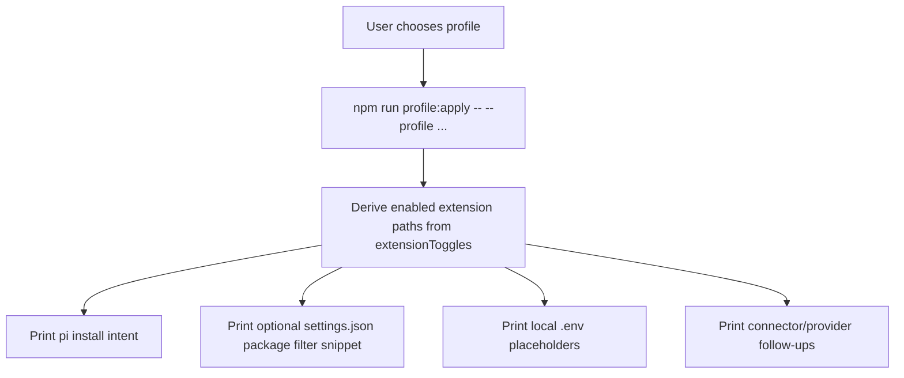

# feat: Make Quotio a selectable provider integration

## Goal Capsule

| Field | Value |
|---|---|
| Objective | Keep Quotio out of the MCP connector path while making it easy to select as an optional oh-my-pi provider integration. |
| Authority hierarchy | User request: do not promote blindly; prior verdict: keep Quotio as provider-backed integration; Pi docs: providers are registered by extensions and packages only distribute/filter resources. |
| Execution profile | Small software/docs change in the oh-my-pi package profile and setup UX. |
| Stop conditions | Do not add `/connector-login quotio`, do not reclassify Quotio as `oauth-mcp`, do not store local endpoint/API key values. |
| Tail ownership | Any actual local install, `.env` creation, or OAuth/provider credential setup remains a user-local action printed by dry-run profile tooling. |

---

## Product Contract

### Summary

Quotio should remain a model provider extension rather than an MCP workspace connector, but oh-my-pi should present it as an optional selectable integration in the same local distribution/profile UX that already distinguishes default, workspace, proxy-provider, and full setups.

### Problem Frame

The current code already keeps Quotio separate from MCP connectors at runtime, but the install/setup story still reads like the package installs all extension surfaces and relies mostly on env toggles to activate them. The user wants Quotio to be available as an option without implying that it belongs in `/connector-login` or workspace MCP flows.

### Requirements

- R1. Quotio remains classified as a provider-backed integration, not an OAuth MCP connector.
- R2. oh-my-pi profile apply output shows a concrete optional-install shape for the selected profile, including which package extensions are selected for `default`, `workspace`, `proxy-provider`, and `full` profiles.
- R3. The setup UX names Quotio as a selectable provider profile and keeps Linear/Notion/GitHub under workspace connector language.
- R4. Documentation explains the recommended choice: use `proxy-provider` for Quotio-only, `workspace` for workspace connectors, and `full` for both.
- R5. No local secret values, endpoints, OAuth state, or machine-specific auth files are written or committed.

### Scope Boundaries

- Deferred for later: a fully interactive `/oh-my-pi setup` wizard that edits settings or `.env` automatically.
- Deferred for later: publishing separate npm packages per capability.
- Outside this change: adding Quotio to `/connector-login`, `/connector-tools`, or `WORKSPACE_MCP_SERVICE_IDS`.
- Outside this change: changing Quotio provider request semantics, model discovery, or API compatibility behavior.

### Acceptance Examples

- AE1. Given a user wants only Quotio, when they run `npm run profile:apply -- --profile proxy-provider`, then the dry-run output shows a core package install/settings entry selecting `env-loader`, `quotio-provider`, and `setup-doctor`, plus the required local `.env` placeholders and `/quotio-status` follow-up.
- AE2. Given a user wants only workspace connectors, when they run `npm run profile:apply -- --profile workspace`, then the dry-run output selects `env-loader`, `workspace-connectors`, and `setup-doctor`, and does not present Quotio as enabled.
- AE3. Given a user reads the command palette, when `/oh-my-pi` is shown, then it lists the profile choices and does not describe Quotio as a connector login target.

---

## Planning Contract

### Key Technical Decisions

- KTD1. Keep connector taxonomy unchanged. `extensions/connector-backend-catalog.ts` already models Quotio as `backendKind: "provider"` / `adapterKind: "pi-provider"`, while workspace commands route only OAuth MCP services. The implementation should preserve that boundary.
- KTD2. Represent optionality through profile-selected package resource filters plus env toggles. Pi packages distribute extensions, while object-form package entries can filter loaded resources; the profile tool can print the exact selected extension set without performing writes.
- KTD3. Make dry-run output more actionable, not more mutating. `profile:apply` should continue to avoid running `pi install`, writing `.env`, or starting OAuth; it should print copyable install/settings guidance and local follow-ups.

### High-Level Technical Design

### Assumptions

- Pi package filtering accepts object-form package settings with `source`, `extensions`, `prompts`, and `themes` filters as documented in Pi `docs/packages.md`.
- Existing profile files already encode the intended default/optional capability split via `extensionToggles.enabledByDefault`; implementation can derive selected extensions from that field instead of adding a new schema version.

### Sources / Research

- `extensions/connector-backend-catalog.ts:114-130` already classifies Quotio as a provider-backed integration and explicitly not an MCP connector.
- `extensions/quotio-provider/index.ts:57-141` registers Quotio as a Pi provider gated by `ENABLE_QUOTIO` and exposes `/quotio-status`.
- `docs/profiles/proxy-provider.profile.json:84-91` already represents Quotio under `providers`, not `connectors`.
- Pi docs: `docs/custom-provider.md:3` says extensions register custom model providers via `pi.registerProvider()`.
- Pi docs: `docs/packages.md:189-215` documents package resource filtering for optional extension/resource loading.

---

## Implementation Units

### U1. Add selected-resource guidance to profile apply output

- **Goal:** Make `profile:apply` print a concrete optional install/settings shape for the selected profile.
- **Requirements:** R2, R5, AE1, AE2
- **Files:** `scripts/profile-pack.mjs`
- **Approach:**
  - Derive selected package extension paths from `profile.extensionToggles` entries where `enabledByDefault` is true.
  - Keep the existing `pi install ...` intent list for quick installs.
  - Add a new dry-run section that prints a copyable object-form settings entry for the core oh-my-pi package, including selected `extensions`, `prompts`, and `themes`.
  - Preserve the non-destructive contract: no filesystem writes beyond existing command behavior and no secret values.
- **Patterns:** Follow current `commandApply` dry-run output style in `scripts/profile-pack.mjs:328-376`.
- **Test Scenarios:**
  - `npm run profile:verify` still passes.
  - `npm run profile:apply -- --profile proxy-provider` includes `./extensions/quotio-provider` in the selected extension list.
  - `npm run profile:apply -- --profile workspace` omits `./extensions/quotio-provider` from the selected extension list and includes `./extensions/workspace-connectors`.
  - `npm run profile:apply -- --profile default` includes only the always-on extension surfaces and no secret placeholders.
- **Verification:** `npm run profile:verify` and representative `profile:apply` dry-runs for `default`, `workspace`, `proxy-provider`, and `full`.

### U2. Update setup palette and README profile guidance

- **Goal:** Make the user-facing oh-my-pi setup surface describe Quotio as a selectable provider profile, not a connector.
- **Requirements:** R1, R3, R4, AE3
- **Files:** `extensions/setup-doctor/index.ts`, `README.md`
- **Approach:**
  - Extend `/oh-my-pi` palette text with a concise profile chooser: `default`, `workspace`, `proxy-provider`, `full`.
  - Keep `/connector-login linear|notion` wording limited to workspace connectors.
  - Update README setup text to show the profile commands and clarify that Quotio is enabled by the `proxy-provider` or `full` profiles plus local `.env` values.
- **Patterns:** Follow existing palette output in `extensions/setup-doctor/index.ts:351-366` and README setup command style.
- **Test Scenarios:**
  - Palette text includes `proxy-provider` and `/quotio-status` without adding `/connector-login quotio`.
  - README lists Quotio under provider profile guidance and keeps Linear/Notion under workspace connector guidance.
- **Verification:** TypeScript compile for touched extension files and grep checks for absence of `/connector-login quotio`.

### U3. Preserve profile/schema compatibility

- **Goal:** Ensure the new optional-install guidance does not require schema migration or profile lock drift beyond intentional output changes.
- **Requirements:** R2, R5
- **Files:** `docs/profiles/*.profile.json`, `docs/profiles/oh-my-pi.profile-lock.json` only if verification indicates an intentional lock update is required.
- **Approach:**
  - Prefer no schema changes because `extensionToggles.enabledByDefault` already encodes selected capabilities.
  - If profile lock verification fails due to changed committed profile files, regenerate with `npm run profile:lock -- --write`; otherwise leave profile artifacts unchanged.
- **Test Scenarios:**
  - `npm run profile:verify` passes before and after implementation.
  - If the lock changes, the changed lock reflects only intentional profile metadata changes.
- **Verification:** `npm run profile:verify`.

---

## Verification Contract

| Command | Covers | Expected result |
|---|---|---|
| `npm run profile:verify` | U1, U3 | Profile schema and lock verification pass. |
| `npm run profile:apply -- --profile default` | U1 | Dry-run shows selected extensions for default without Quotio/workspace optional extensions. |
| `npm run profile:apply -- --profile proxy-provider` | U1 | Dry-run shows Quotio selected and prints `ENABLE_QUOTIO`, `QUOTIO_BASE_URL`, `QUOTIO_API_KEY`, and `/quotio-status`. |
| `npm run profile:apply -- --profile workspace` | U1 | Dry-run shows workspace connectors selected and connector login follow-ups. |
| `npm run profile:apply -- --profile full` | U1 | Dry-run shows both Quotio and workspace connector surfaces selected. |
| `npm exec tsc -- --module NodeNext --moduleResolution NodeNext --target ES2022 --noEmit --skipLibCheck --types node extensions/setup-doctor/index.ts` | U2 | Touched TypeScript extension compiles. |

---

## Definition of Done

- U1 is complete when profile apply output provides a copyable selected-resource settings snippet and profile-specific selected extension list without mutating local files.
- U2 is complete when `/oh-my-pi` and README describe Quotio as a provider profile option and keep connector login language scoped to Linear/Notion.
- U3 is complete when profile verification passes and any lock changes are intentional.
- The whole plan is complete when no code path treats Quotio as an OAuth MCP connector and the verification commands above pass or have documented environment-specific reasons for being skipped.
